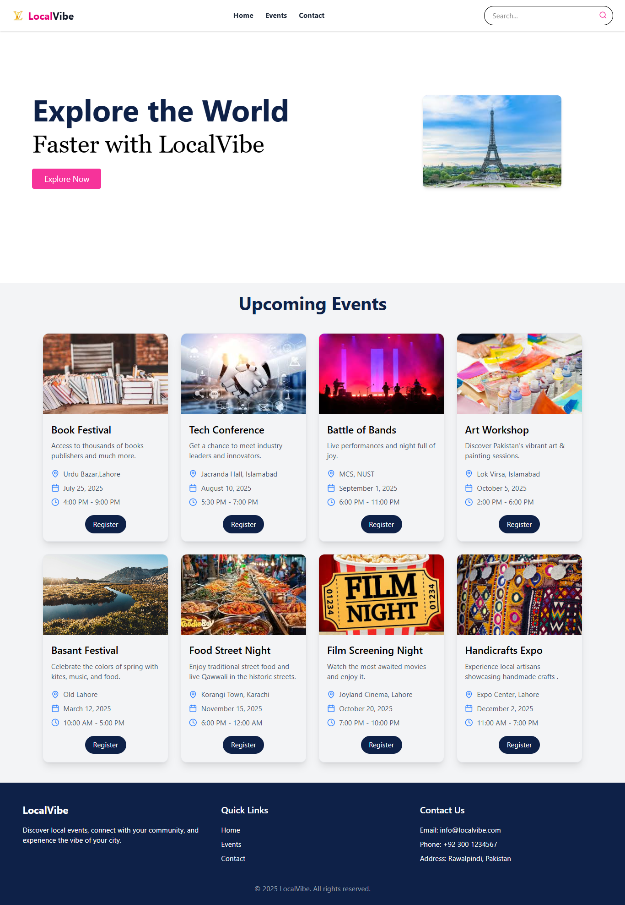

# LocalVibe

**LocalVibe** is a responsive front-end project designed to help users explore local events and experiences with ease. Built using modern technologies, it offers a clean user interface and intuitive navigation.

## 🛠 Technologies Used

- **React** – For building interactive UI components
- **JavaScript** – For dynamic functionality
- **HTML** – For page structure
- **Tailwind CSS** – For responsive, utility-first styling
- **Lucide-react** – For icons (location, map, time, etc.)

## 🚀 How to Run the Project

Follow the steps below to set up and run the project in your local environment:

1. **Clone the Repository**
   ```bash
   git clone https://github.com/DanyalSarwar325/CareerDynamics_CaseStudy.git

2. Run command - npm i
3. Run Command-  npm run dev

1. **Vercel Link*

https://career-dynamics-case-study.vercel.app/

## 📸 Project Screenshot

